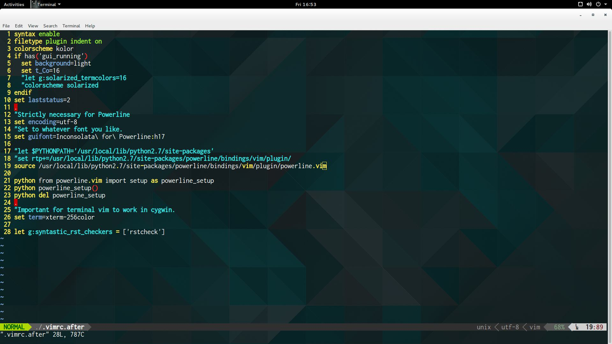

# vim configuration for CentOS 6.x running on a VPS

## Intro

- this backup is essentially the [Janus distribution](https://github.com/carlhuda/janus), with a few minor customizations. It's actually almost the same as the one I use on my Ubuntu-Gnome Desktop. I copied the configuration from my Ubuntu and only made a change in the `.vimrc.after` file. This was the tricky part -- I struggled to get my [powerline-status](https://pypi.python.org/pypi/powerline-status) working, but eventually I managed, just by adding one line to the `.vimrc.after`. Just one line made all the difference!

## Prerequisites

- I'm assuming you're running CentOS `6.x`on a VPS, and you can access it from any machine whether GNU/Linux or Windows or Mac, etc
- ensure [python](https://www.python.org/) is installed with the [powerline-status](https://pypi.python.org/pypi/powerline-status) plugin which can be installed via `pip install powerline-status`. Now, by default, CentOS 6.5 comes with python 2.6. For some reasons, I wanted Python 2.7 so I followed [this tutorial](http://toomuchdata.com/2014/02/16/how-to-install-python-on-centos/) to set it up on one of my VPSes. I did't remove the default python 2.6, so I had two python 2.x installations!
- ensure that you have [powerline fonts](https://github.com/powerline/fonts) installed on your system. Also Download and install the **Powerline Symbols** Font from [here](https://github.com/Lokaltog/powerline/raw/develop/font/PowerlineSymbols.otf). [This link](http://askubuntu.com/questions/283908/how-can-i-install-and-use-powerline-plugin), though based on Ubuntu, provides excellent instructions on how to install your fonts.
- The shell you use to `ssh` into your VPS must be configured to use the font **inconsolata for powerline**, the font size must be set to 17. You will notice that this is my default setup on all the machines I use.

# Procedure

- There are two files you need from this repository: `.vimrc.after` and `vim_centOS_headless.tgz`. Once the prerequisites have been met, simply do the following:
  - You have to copy the `.vimrc.after` file into your home directory, and extract the compressed tarball `vim_centOS_headless.tgz` into your home directory.
  - while still in the home directory, you need to create a symbolic link to the vimrc file in the Janus distribution by running `ln -s .vim/janus/vim/vimrc .vimrc`.
  - check line 19 in the `.vimrc.after` file. This is what makes all the difference! Ensure that the path there matches the path on your system.
