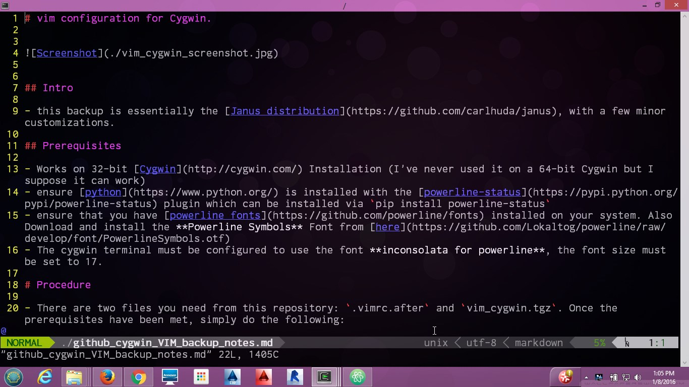

# vim configuration for Cygwin.

## Intro

- this backup is essentially the [Janus distribution](https://github.com/carlhuda/janus), with a few minor customizations.

## Prerequisites

- Works on 32-bit [Cygwin](http://cygwin.com/) Installation (I've never used it on a 64-bit Cygwin but I suppose it can work)
- ensure [python](https://www.python.org/) is installed with the [powerline-status](https://pypi.python.org/pypi/powerline-status) plugin which can be installed via `pip install powerline-status`
- ensure that you have [powerline fonts](https://github.com/powerline/fonts) installed on your system. Also Download and install the **Powerline Symbols** Font from [here](https://github.com/Lokaltog/powerline/raw/develop/font/PowerlineSymbols.otf)
- The cygwin terminal must be configured to use the font **inconsolata for powerline**, the font size must be set to 17.

## Procedure

- There are two files you need from this repository: `.vimrc.after` and `vim_cygwin.tgz`. Once the prerequisites have been met, simply do the following:
  - You have to copy the `.vimrc.after` file into your home directory, and extract the compressed tarball `vim_cygwin.tgz` into your home directory.
  - while still in the home directory, you need to create a symbolic link to the vimrc file in the Janus distribution by running `ln -s .vim/janus/vim/vimrc .vimrc`.
