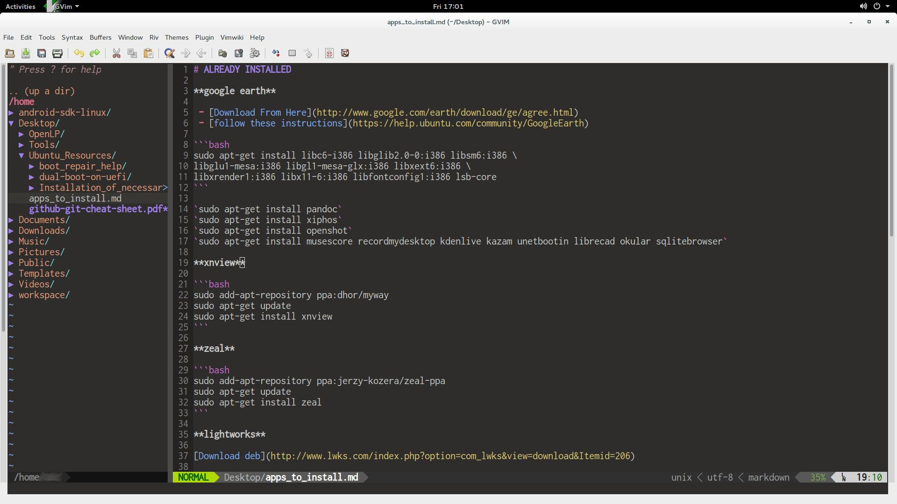
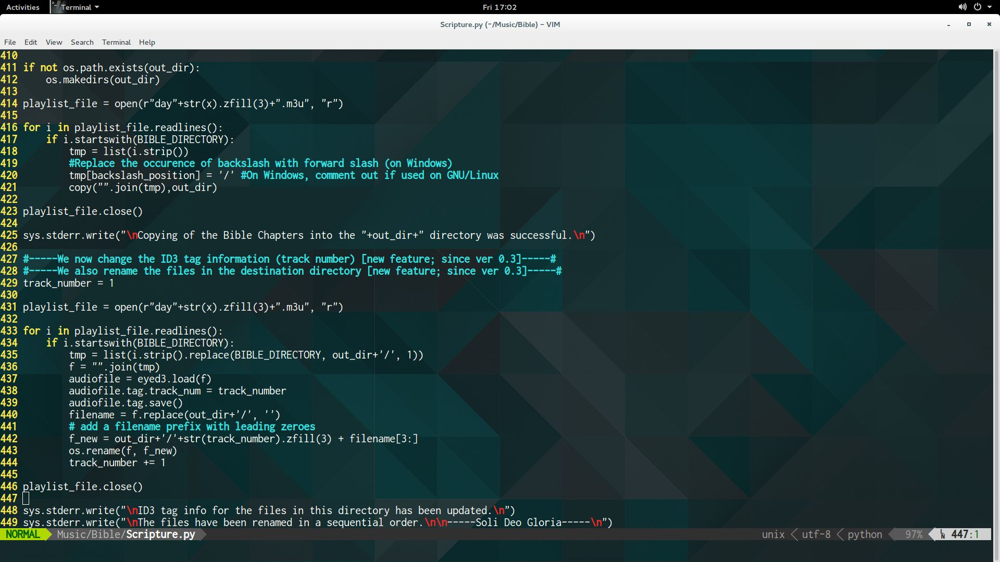

# vim configuration for Ubuntu Gnome Desktop

## Intro

- this backup is essentially the [Janus distribution](https://github.com/carlhuda/janus), with a few minor customizations. It works for both `vim` and `gvim` on Ubuntu (as shown in the two screenshots above). I use the Ubuntu-Gnome flavor.

## Prerequisites

- ensure [python](https://www.python.org/) is installed with the [powerline-status](https://pypi.python.org/pypi/powerline-status) plugin which can be installed via `pip install powerline-status`.
- `sudo apt-get install vim-nox-py2`
- ensure that you have [powerline fonts](https://github.com/powerline/fonts) installed on your system. Also Download and install the **Powerline Symbols** Font from [here](https://github.com/Lokaltog/powerline/raw/develop/font/PowerlineSymbols.otf). [This link](http://askubuntu.com/questions/283908/how-can-i-install-and-use-powerline-plugin) provides excellent instructions on how to install your fonts.
- The shell you use must be configured to use the font **inconsolata for powerline**, the font size must be set to 17. You will notice that this is my default setup on all the machines I use.

## Procedure

- There are three files you need from this repository: `.vimrc.after`, `.gvimrc.after` and `vim_ubuntu.tgz`. Once the prerequisites have been met, simply do the following:
  - You have to copy the `.vimrc.after` and `.gvimrc.after` files into your home directory, and extract the compressed tarball `vim_ubuntu.tgz` into your home directory.
  - while still in the home directory, you need to create a symbolic link to the vimrc file in the Janus distribution by running `ln -s .vim/janus/vim/vimrc .vimrc`.
  - similarly, you need to create a symbolic link to the gvimrc file in the Janus distribution by running `ln -s .vim/janus/vim/gvimrc .gvimrc`.
