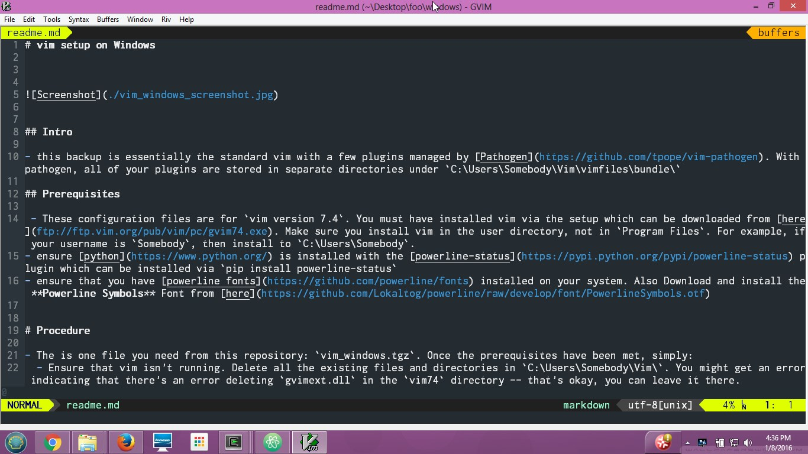

# vim setup on Windows

## Intro

- this backup is essentially the standard vim with a few plugins managed by [Pathogen](https://github.com/tpope/vim-pathogen). With pathogen, all of your plugins are stored in separate directories under `C:\Users\Somebody\Vim\vimfiles\bundle\`

## Prerequisites

 - These configuration files are for `vim version 7.4`. You must have installed vim via the setup which can be downloaded from [here](ftp://ftp.vim.org/pub/vim/pc/gvim74.exe). Make sure you install vim in the user directory, not in `Program Files`. For example, if your username is `Somebody`, then install to `C:\Users\Somebody`.
- ensure [python](https://www.python.org/) is installed with the [powerline-status](https://pypi.python.org/pypi/powerline-status) plugin which can be installed via `pip install powerline-status`
- ensure that you have [powerline fonts](https://github.com/powerline/fonts) installed on your system. Also Download and install the **Powerline Symbols** Font from [here](https://github.com/Lokaltog/powerline/raw/develop/font/PowerlineSymbols.otf)

## Procedure

- The is one file you need from this repository: `vim_windows.tgz`. Once the prerequisites have been met, simply:
  - Ensure that vim isn't running. Delete all the existing files and directories in `C:\Users\Somebody\Vim\`. You might get an error indicating that there's an error deleting `gvimext.dll` in the `vim74` directory -- that's okay, you can leave it there.
  - Extract the compressed tarball `vim_windows.tgz` into a temporary directory and then cut and paste the contents of the extracted `Vim` directory into the `C:\Users\Somebody\Vim\` directory. If you got the `gvimext.dll` error above, you will be unable to replace the `gvimext.dll` file. Again, that's okay. We're done!
